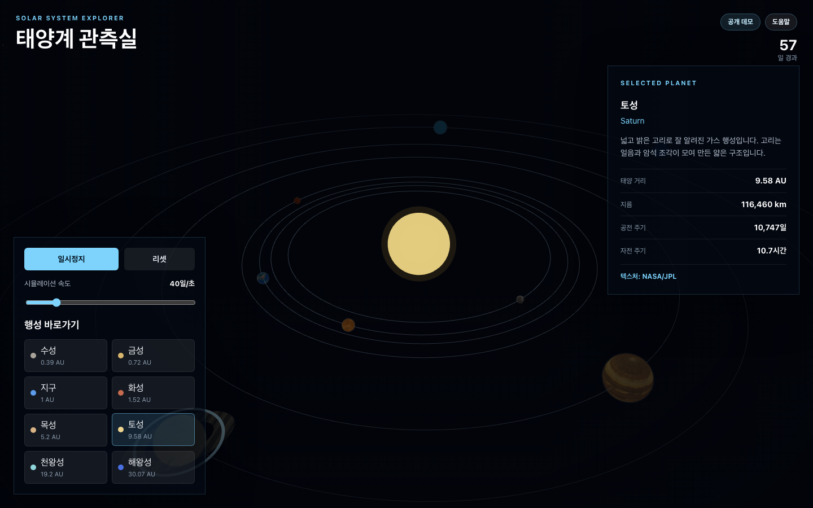
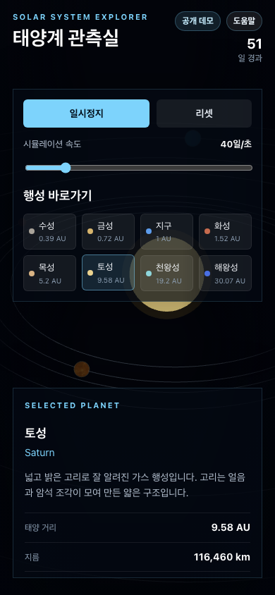

# 3D Solar System Simulator

React, Three.js, and React Three Fiber로 만든 한국어 3D 태양계 관측 앱입니다.

**Live Demo:** https://jinhyuk9714.github.io/3d/




## Features

- 태양과 8개 행성의 3D 궤도 시뮬레이션
- 교육용으로 압축한 거리/크기 표현
- 재생, 일시정지, 리셋, 시간 속도 조절
- 행성 선택 시 카메라 포커스 이동
- 실제 거리, 지름, 공전 주기, 자전 주기 정보 패널
- NASA/JPL 계열 공개 텍스처 기반 행성 표면
- 데스크톱과 모바일 반응형 UI
- GitHub Pages 자동 배포

## Tech Stack

- Vite
- React + TypeScript
- Three.js
- React Three Fiber
- Drei
- Vitest
- Playwright

## Local Development

```bash
npm install
npm run dev
```

## Scripts

```bash
npm test
npm run lint
npm run build
npm run test:e2e
```

## Deployment

`main` 브랜치에 push하면 GitHub Actions가 `npm ci`와 `npm run build`를 실행한 뒤 `dist`를 GitHub Pages에 배포합니다.

배포 URL은 `https://jinhyuk9714.github.io/3d/`입니다.

## Texture Sources

행성 표면은 NASA 3D Resources와 JPL Solar System Simulator texture maps의 공개 자료를 로컬 WebP로 변환해 사용합니다.

자세한 출처와 변환 방식은 `public/textures/README.md`에 정리되어 있습니다. 일부 외행성 맵은 관측 자료를 바탕으로 한 대표/가공/fictional 성격이 있으므로, 이 앱의 렌더링은 교육용 시각화이며 과학 분석용 데이터가 아닙니다.
