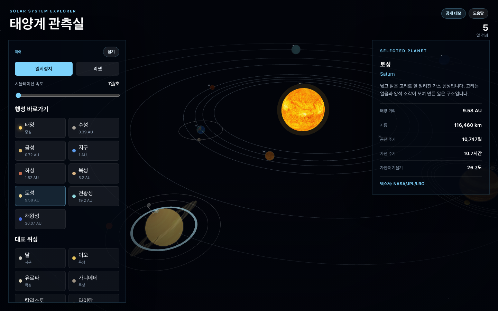
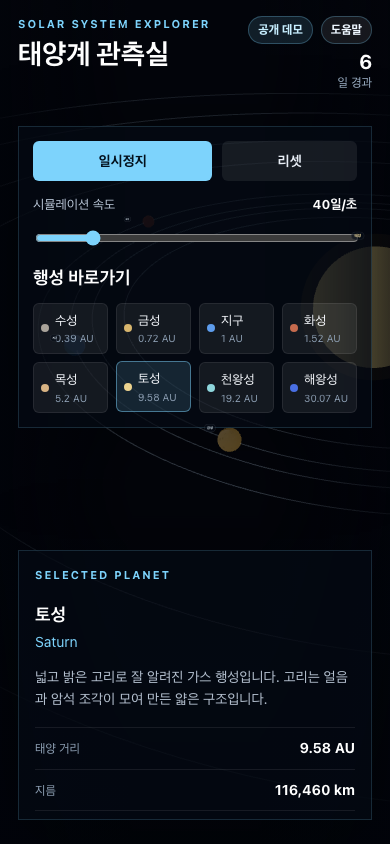

# 3D Solar System Simulator

3D Solar System Simulator는 한국어 UI로 태양계의 태양, 8개 행성, 대표 위성, 궤도, 자전축을 살펴볼 수 있는 3D 관측 데모입니다. React Three Fiber 기반 장면과 정보 패널을 함께 구성해 천체를 선택하고 카메라를 이동하며 비교할 수 있게 했습니다.

라이브 데모: [jinhyuk9714.github.io/3d](https://jinhyuk9714.github.io/3d/)

## 스크린샷

### 데스크톱



### 모바일



## 문제 의식

태양계 데이터는 숫자로 보면 거리와 크기 차이가 너무 커서 한 화면에서 감각적으로 비교하기 어렵습니다. 이 데모는 교육용 관찰 경험에 맞춰 압축 스케일을 사용하고, 공전 흐름과 천체별 정보를 함께 보여주는 데 집중합니다.

## 주요 기능

- 태양과 8개 행성의 3D 궤도 표시
- 달, 이오, 유로파, 가니메데, 칼리스토, 타이탄, 엔셀라두스, 트리톤 표시
- 마우스/터치 기반 회전, 확대, 이동
- 천체 클릭 또는 목록 선택 시 카메라 이동
- 선택한 천체의 지름, 거리, 공전/자전 정보 패널
- 재생, 일시정지, 리셋, 속도 조절
- 행성 자전축 기울기와 선택 시 축 가이드
- 로딩 진행률, WebGL 미지원 안내, 모바일 렌더링 최적화
- GitHub Pages 자동 배포

## 기술 스택

| 영역 | 사용 기술 |
| --- | --- |
| 앱 | React 19, TypeScript, Vite |
| 3D | Three.js, React Three Fiber, Drei |
| 테스트 | Vitest, Playwright |
| 배포 | GitHub Actions, GitHub Pages |

## 프로젝트 구조

```text
3d/
├── src/
│   ├── config/          # 렌더링/스케일 설정
│   ├── data/            # 태양계 천체 데이터
│   ├── scene/           # Three.js/R3F 장면 구성
│   └── test/            # 테스트 설정
├── public/
│   ├── screenshots/     # README 스크린샷
│   └── textures/        # 태양, 행성, 위성 텍스처와 출처 문서
├── tests/               # Playwright E2E 테스트
└── package.json
```

## 로컬 실행

```bash
npm install
npm run dev
```

## 검증

```bash
npm test
npm run lint
npm run build
npm run test:e2e
```

## 배포

`main` 브랜치에 push하면 GitHub Actions가 정적 빌드를 만들고 GitHub Pages에 배포합니다.

- Demo: [https://jinhyuk9714.github.io/3d/](https://jinhyuk9714.github.io/3d/)
- Workflow: [`.github/workflows/deploy.yml`](.github/workflows/deploy.yml)

## 텍스처와 범위

태양, 행성, 위성 표면은 NASA 3D Resources, NASA SVS CGI Moon Kit, JPL Solar System Simulator texture maps 계열 공개 자료를 로컬 WebP로 변환해 사용합니다. 출처와 변환 방식은 `public/textures/README.md`에 정리되어 있습니다.

이 앱은 관찰형 교육 데모입니다. 실제 N-body 물리, 실시간 ephemeris, 모든 위성/소행성, 식 현상은 포함하지 않습니다.
